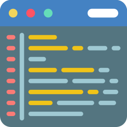
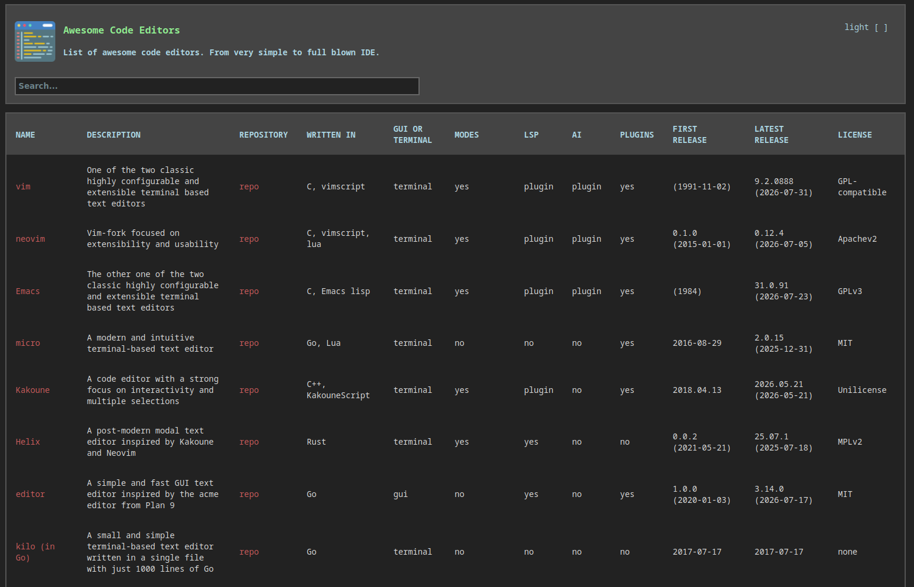

<link rel="stylesheet" href="./readme.css"/>

Awesome Editors
================

A curated list of awesome editors ranging from simple like nano to full blown IDE like IntelliJ.

Visit the  [website](https://sweintritt.github.io/awesome-editors.github.io/) to search and
filter editors more easily and to get more information about each editor. Like license or
the language it is written in.

---
# Editors
---

[Code icon](https://www.flaticon.com/free-icons/code)
created by
[Smashicons](https://www.flaticon.com/authors/smashicons)